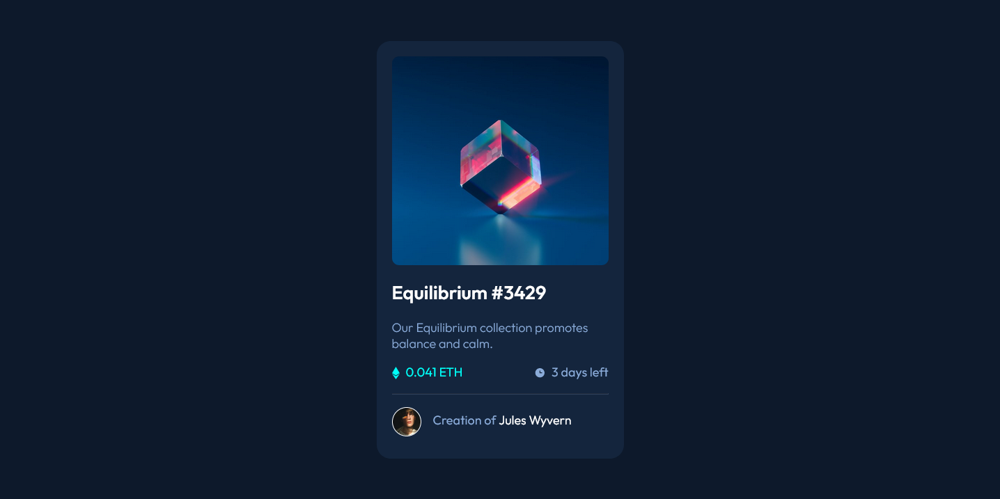
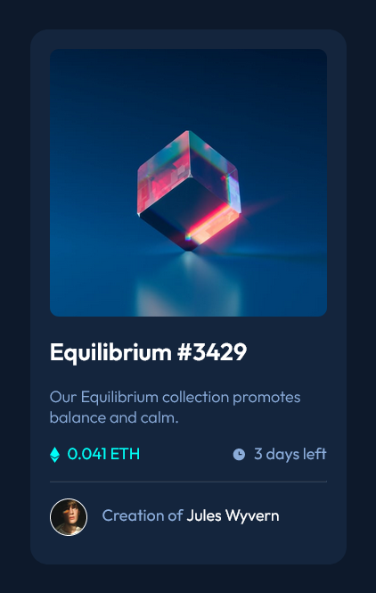

# Frontend Mentor - NFT preview card component solution

This is a solution to the [NFT preview card component challenge on Frontend Mentor](https://www.frontendmentor.io/challenges/nft-preview-card-component-SbdUL_w0U). Frontend Mentor challenges help you improve your coding skills by building realistic projects. 

## Table of contents

- [Overview](#overview)
  - [Screenshot](#screenshot)
  - [Links](#links)
- [My process](#my-process)
  - [Built with](#built-with)
  - [What I learned](#what-i-learned)
  - [Useful resources](#useful-resources)
- [Author](#author)
- [Acknowledgments](#acknowledgments)

## Overview

### Screenshot

.
.

### Links

- Solution URL: [repositories](https://github.com/Lo-Deck/NFT-preview-card-component)
- Live Site URL: [website](https://lo-deck.github.io/NFT-preview-card-component/)

## My process

### Built with

- Semantic HTML5 markup
- CSS custom properties
- Flexbox
- Mobile-first workflow

### What I learned

Using background with different image.

### Useful resources

- [Mozilla mdn](https://developer.mozilla.org/) - Very useful.

## Author

- Frontend Mentor - [@Lo-deck](https://www.frontendmentor.io/profile/Lo-Deck)

## Acknowledgments

Thanks to Front-end Mentor and his community.
